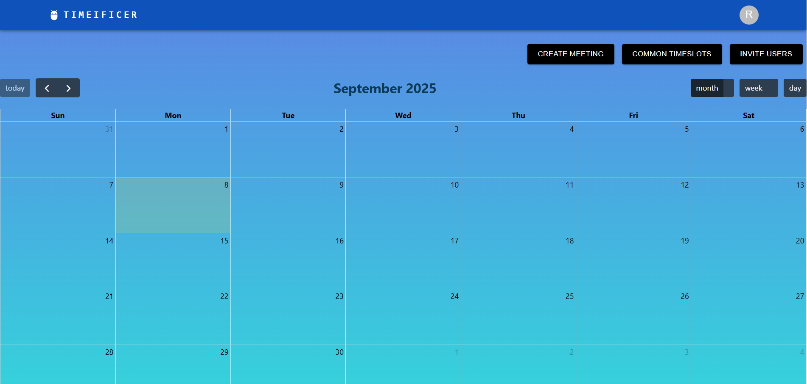
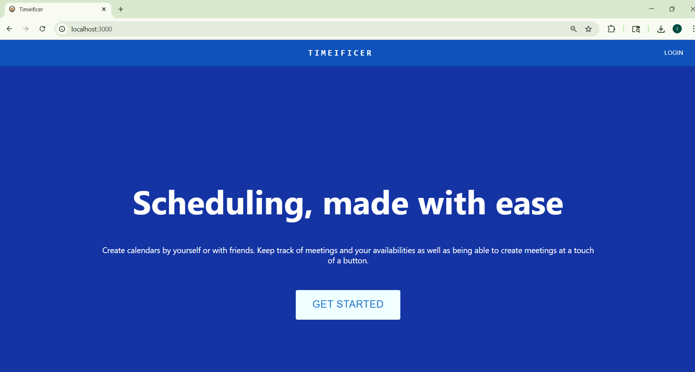
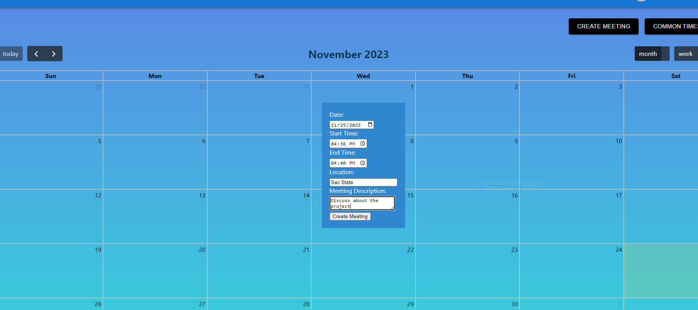
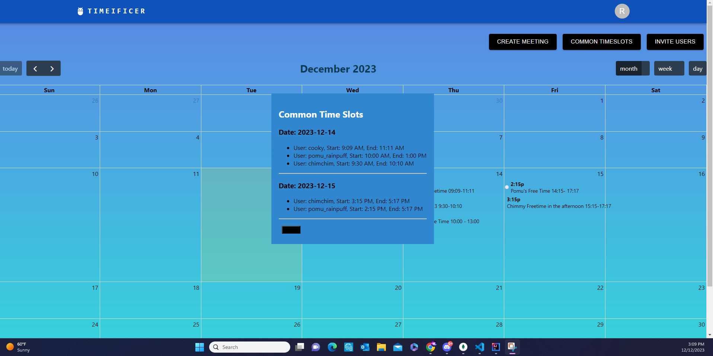

# Code Artificers — Timeificers

_A team collaboration project for CSC131 (Computer Software Engineering)_  
Initial release: **December 15, 2023**

<b>Default Calendar View</b><br>
<p align="center">
  
</p>


This project consists of creating a software application to make scheduling meetings easier.  
Specifically, **Timeificers** is a web app designed to simplify scheduling for large groups with diverse availability.

For clarification purposes:  
- The **`scheduling-app/`** folder includes the **back-end Java files** (developed with IntelliJ).  
- The **`schedule-project/`** folder includes the **front-end React files** (developed with VS Code).  

<br></br>
## Table of Contents

- [Overview](#overview)
- [Purpose](#purpose)
- [Feature Summary](#feature-summary)
- [Screenshots](#screenshots)
- [Installation](#installation)
  - [Getting the Code](#getting-the-code)
  - [Backend — IntelliJ (Java)](#backend--intellij-java)
  - [Frontend — VS Code (React)](#frontend--vs-code-react)
- [How It Works (Quick Walkthrough)](#how-it-works-quick-walkthrough)
- [Tech Stack](#tech-stack)
- [Credits](#credits)


<br></br>
## Overview

Professor Kane needed a scheduling solution to simplify coordinating Senior Project meetings with many students at California State University, Sacramento.  
**Timeificers** provides a shared platform for accounts, calendars, availability, and meetings so everyone can find common times quickly and confidently.

<br></br>
## Purpose
Timeificers is designed to coordinate multiple users’ availability and make it easy to **find and book common meeting times**. Users can:

- Create personal accounts and calendars  
- Share calendars with others by email invite  
- Add/edit/delete their own availability windows  
- See common timeslots across the group  
- Create/edit/delete/view meetings based on those common slots

<br></br>
## Feature Summary

-  **Sign-Up & Login with Authentication**  
-  **Homepage with Personal & Shared Calendars**  
-  **Profile Page**  
-  **Calendars (Month / Week / Day)**  
-  **Create / Edit / Delete Availabilities**  
-  **Create / Edit / View / Delete Meetings**  
-  **Find Common Timeslots**  
-  **Invite Users to Calendars**  
-  **Logout**

(Full descriptions of each feature are included in the detailed write-up.)


<br></br>
## Screenshots

> Images are stored under `schedule-project/src/components/assets/readme/`

<b>Front Page</b><br>
<p align="center">
  
</p>

<b>Creating a Meeting</b><br>
<p align="center">
  
</p>

<b>Common Timeslots Across Users</b><br>
<p align="center">
  
</p>

<br></br>
## Installation

### Getting the Code

```bash
git clone https://github.com/isg28/CodeArtificers.git
```

### Backend — IntelliJ (Java)

1. Open **`scheduling-app/`** in IntelliJ.  
2. Set **Project SDK** to Oracle OpenJDK 21.  
   - Download: [Oracle JDK Downloads](https://www.oracle.com/java/technologies/downloads/)  
3. Install the **Lombok** plugin and enable annotation processing.  
4. Run the main application:  
```bash
scheduling-app/src/main/java/com/codeartificers/schedulingapp/SchedulingAppApplication.java
```

---

### Frontend — VS Code (React)

1. Open **`schedule-project/`** in VS Code.  
2. Install dependencies:  
```bash
npm install
```

(If needed, also run `npm install react-scripts`)  

3. Start the dev server:  
```bash
npm start
```


Open your browser at: http://localhost:3000/

<br></br>
## How It Works (Quick Walkthrough)

1. **Sign Up / Login** → receive a token for authenticated actions.  
2. **Create a Calendar** on the Home page (or open a shared one).  
3. **Invite Users** by email to collaborate on the same calendar.  
4. **Add Availability** (your own time windows) using the calendar’s day clicks.  
5. **Find Common Times** across members with 'Common Timeslots'.  
6. **Create a Meeting** for an agreed time.  
7. **Edit / View / Delete** meetings as needed.  
8. **Logout** to wipe tokens and return to the login screen.

<br></br>
## Tech Stack

- **Frontend:** React, JavaScript, HTML, CSS  
- **Backend:** Java (Spring Boot, Lombok)  
- **Runtime:** Oracle OpenJDK 21  
- **IDE:** IntelliJ IDEA (backend), VS Code (frontend)  

<br></br>
## Credits

- **Team:** Code Artificers (CSC131 project group)
    - Isabel Santoyo-Garcia, Danica Galang, Mansoor Ali, Brandon Nguyen, & Oscar Lu
- **Use Case Partner/Stakeholder:** Professor Kane, CS Department, Sacramento State  
- **Repo:** [https://github.com/isg28/CodeArtificers](https://github.com/isg28/CodeArtificers)

